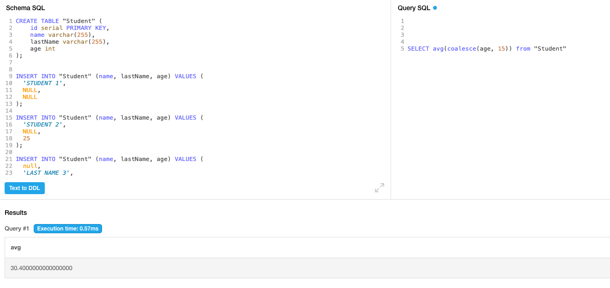
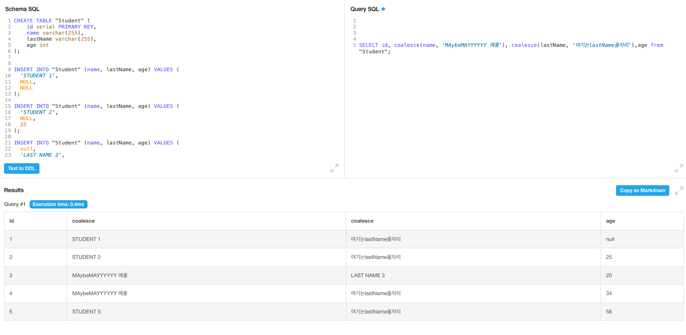

## COALESCE — Quick Guide

COALESCE returns the first non-NULL value from its arguments. Use it to replace NULLs with a sane fallback.

Syntax:

```
COALESCE(expr1, expr2, ..., exprN)
```

Examples:

- `SELECT COALESCE(first_name, 'No Name') AS name FROM students;`
- `SELECT COALESCE(primary_email, secondary_email, 'no-email') AS contact FROM contacts;`
- `SELECT SUM(COALESCE(price, 0)) FROM orders;` -- treat NULL price as 0

Image example:




Recommended example:
Because applying a function can change the column name, give the function result an explicit alias using AS to specify the output column name.

```sql
SELECT
	id,
	COALESCE(name, 'No name') AS name,
	COALESCE(lastName, 'No last name') AS lastName,
	COALESCE(age, 0) AS age
FROM "Student";
```

Notes:

- If all args are NULL, result is NULL.
- Use `AS` to name the output column.
- Don't blindly replace NULLs if "unknown" is meaningful.

Supported in all major databases. Alternatives with two-arg behavior: `NVL` (Oracle), `ISNULL` (SQL Server).
