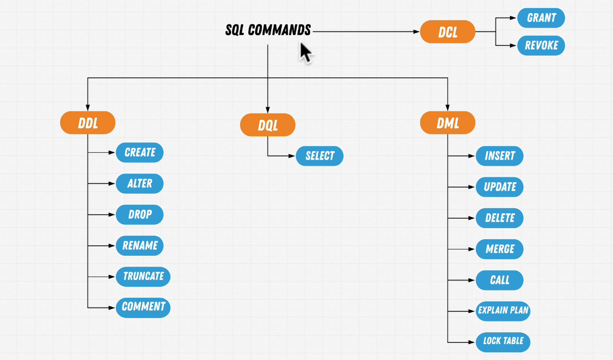

# SQL Commands Overview

SQL (Structured Query Language) is the standard language for managing and manipulating databases.  
SQL commands are categorized into four main types based on their functionality:

---

## Categories of SQL Commands

| Category | Full Name                  | Description                                              |
| -------- | -------------------------- | -------------------------------------------------------- |
| **DDL**  | Data Definition Language   | Used to define and modify database structure and schema. |
| **DML**  | Data Manipulation Language | Used to manipulate data in the database.                 |
| **DQL**  | Data Query Language        | Used to query and retrieve data.                         |
| **DCL**  | Data Control Language      | Used to control access to data and database objects.     |

---

## DDL (Data Definition Language)

- `CREATE` – Create new database objects (e.g., tables, views)
- `ALTER` – Modify existing database structures
- `DROP` – Delete database objects
- `RENAME` – Rename database objects
- `TRUNCATE` – Remove all records from a table (without logging individual row deletions)
- `COMMENT` – Add comments to database objects

---

## DML (Data Manipulation Language)

- `INSERT` – Add new data into a table
- `UPDATE` – Modify existing data
- `DELETE` – Remove existing data
- `MERGE` – Insert or update data conditionally
- `CALL` – Call a stored procedure
- `EXPLAIN PLAN` – Display the execution plan of a SQL statement
- `LOCK TABLE` – Lock a table to prevent concurrent access

---

## DQL (Data Query Language)

- `SELECT` – Retrieve data from one or more tables

---

## DCL (Data Control Language)

- `GRANT` – Give privileges to users
- `REVOKE` – Remove privileges from users

---

## Diagram

> For a visual representation, see the image below:

