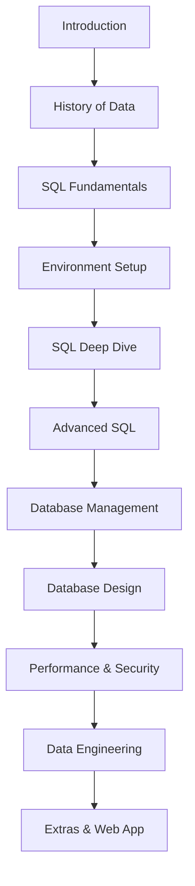

# SELECT \* FROM may;

Welcome to **selectallfrommay**, a personal SQL playground where I explore queries, joins, aggregations, and more, one line at a time.

## 🎓 Course Progress: Complete SQL Mastery

📘 I'm following a structured SQL course and logging my progress here.

| Section | Title                                                       | Status         |
| ------- | ----------------------------------------------------------- | -------------- |
| 1       | Introduction                                                | ✅ In progress |
| 2       | History And Story Of Data                                   | 🔜 Not started |
| 3       | Databases + SQL Fundamentals                                | 🔜 Not started |
| 4       | Environment Setup                                           | 🔜 Not started |
| 5       | SQL Deep Dive                                               | 🔜 Not started |
| 6       | Advanced SQL                                                | 🔜 Not started |
| 7       | Database Management                                         | 🔜 Not started |
| 8       | Solving The Mystery                                         | 🔜 Not started |
| 9       | Database Design                                             | 🔜 Not started |
| 10      | Database Landscape, Performance and Security                | 🔜 Not started |
| 11      | Where To Go From Here?                                      | 🔜 Not started |
| 12      | Extras: Data Engineering (And the role of Machine Learning) | 🔜 Not started |
| 13      | Extras: Redis                                               | 🔜 Not started |
| 14      | Extra Bits: Databases In A Web App (with Node.js)           | 🔜 Not started |
| 15      | BONUS SECTION                                               | 🔜 Not started |

